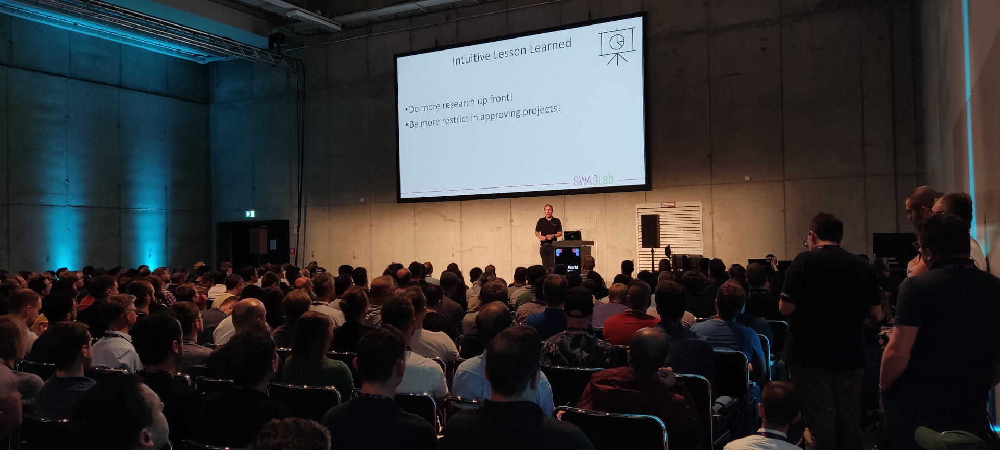

For many years I have been consulting software projects and giving
trainings, talks, and keynotes – and I’m always happy to receive
inquiries. 

## Fancy a casual coffee chat?

Simply book [a slot](https://swaglab.rocks/virtueller-kaffee/eberhard/) for
a virtual coffee. In a Zoom or Teams call we can get to know each
other and discuss a potential collaboration.

Of course, I’m also available via <a
href="javascript:decryptEmail('ZWJlcmhhcmQud29sZmZAc3dhZ2xhYi5yb2Nrcw==');">email</a>.

## Consulting for Software Projects

I support software projects in various formats:

- **Workshop**: In a workshop, I answer questions about software
  architecture and software development. These sessions typically last
  half a day or a full day and are usually held remotely. Any kind of
  project documentation is helpful for preparation. On request, I can
  summarize and present the results in a separate session to increase
  the value of the workshop.

- **Review**: In a review, I examine a project or an architecture in
  detail. An important part of this process includes interviews with
  team members and stakeholders. The findings are compared with
  results from detailed analyses. The outcome is a concise report with
  actionable recommendations.

- **Ongoing Support**: Projects and architectures need continuous
  evolution. What could be more effective than long term guidance?
  Even a small amount of regular external input can help to
  sustainably improve a project.

## Talks and Keynotes

I have been speaking at conferences for over 25 years – by now, I
delivered more than 500 talks. My keynotes include events such as the
IT-Tage, XP Days, the Software Architecture Summit, berlin.jar, as
well as numerous in-house company events. In addition, I regularly
[stream](https://software-architektur.tv) on topics related to
software architecture.

I am also happy to speak at meetups or company events, with topics
tailored to your needs. You can find possible topics in my
[schedule](/schedule.html) and past [talks](/talks.html).
