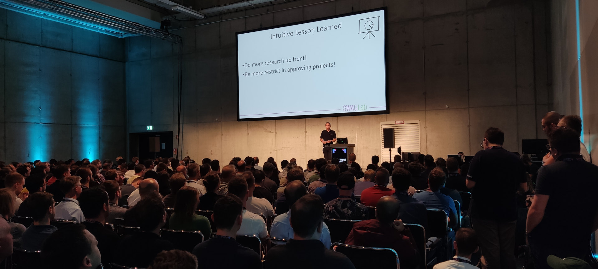

Seit vielen Jahren berate ich Software-Projekte und halte Training,
Vorträge und Keynotes - und freue mich über entsprechende Anfragen.

## Lust auf einen unverbindlich Kaffee?

Buche einfach einen
[Termin](https://calendly.com/eberhard-wolff-swaglab/) für ein
virtuelles Kaffeetrinken. In einem Zoom- oder Teams-Call können wir
uns kennenlernen und eine Zusammenarbeit entspannt
besprechen.

 
Sonst stehe ich auch gerne per
<a
href="javascript:decryptEmail('ZWJlcmhhcmQud29sZmZAc3dhZ2xhYi5yb2Nrcw==');">EMail</a>
zur Verfügung.

## Beratung für Software-Projekte

Ich unterstütze Software-Projekte mit verschiedenen Formaten:

- **Workshop**: In einem Workshop beantworte ich Fragen zu Architektur
und Software-Entwicklung. Solche Sessions dauern in der Regel einen
halben oder ganzen Tag und finden meist remote statt. Zur Vorbereitung
sind alle Arten von Projektdokumenten hilfreich. Auf Wunsch kann ich
die Ergebnisse zusammenfassen und in einem separaten Termin
präsentieren, um den Nutzen des Reviews zusätzlich zu steigern.

- **Review**: Bei einem Review analysiere ich ein Projekt oder eine
  Architektur im Detail. Dazu gehören Interviews mit Beteiligten und
  Stakeholdern sowie der Abgleich mit Ergebnissen anderer
  Analysen. Das Resultat ist ein Bericht mit konkreten
  Handlungsempfehlungen.
  
- **Dauerhafte Begleitung**: Projekte und Architekturen müssen
  konstant weiterentwickelt werden. Was liegt näher, als ein Projekte
  dauerhaft zu begleiten? Oft reicht schon ein geringer Zeitaufwand,
  um durch eine externe Perspektive das Projekt dauerhaft besser
  aufzustellen.

## Vorträge und Keynotes

Seit über 25 Jahren halte ich Vorträge auf Fachkonferenzen –
inzwischen mehr als 500. Keynotes habe ich unter anderem auf den
IT-Tagen, den XP Days, dem Software Architecture Summit, berlin.jar
sowie bei zahlreichen firmeninternen Events gehalten. Darüber hinaus
[streame](https://software-architektur.tv) ich regelmäßig zu Themen
rund um Software-Architektur.

Auch für Meetups oder firmeninterne Veranstaltungen stehe ich gerne
als Sprecher zur Verfügung – ob Vortrag oder Keynote, die Themen
stimmen wir individuell ab. Eine Auswahl möglicher Inhalte findet sich
in meinen [Terminen](/termine.html) und bisherigen
[Vorträgen](/vortraege.html).

👉 Sprich mich gerne an, wenn du einen Impuls für deine Veranstaltung
suchst!
